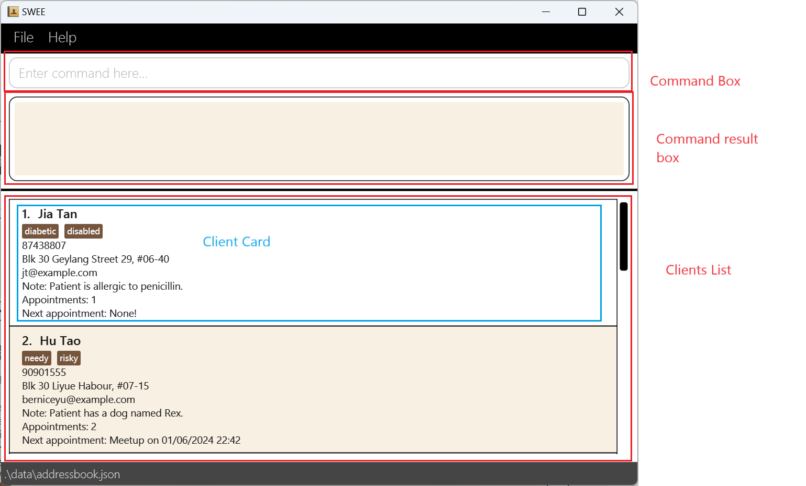
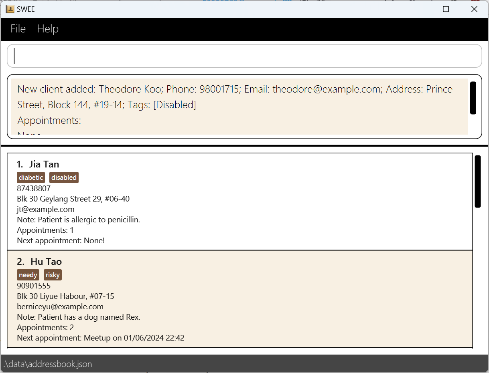
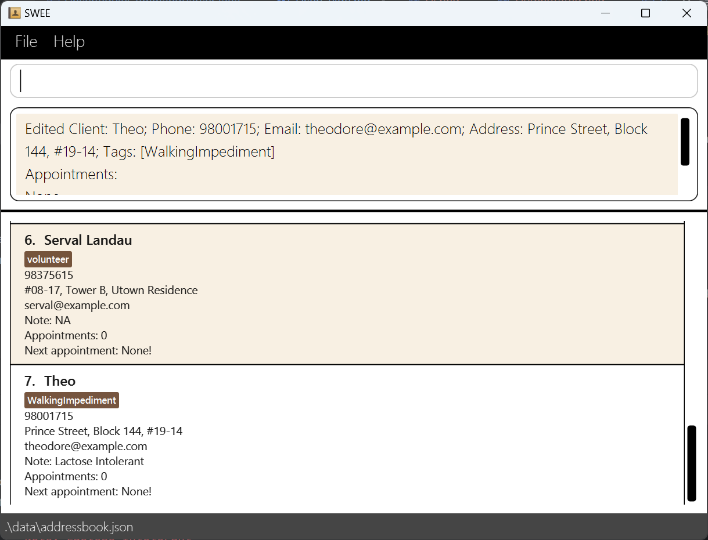
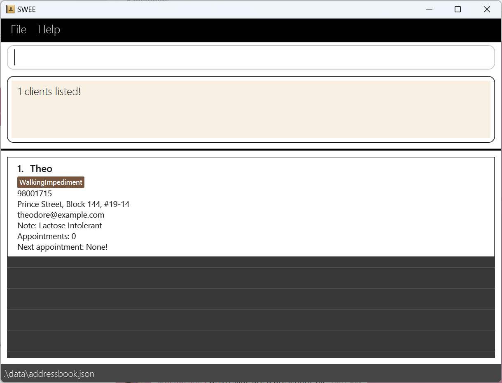
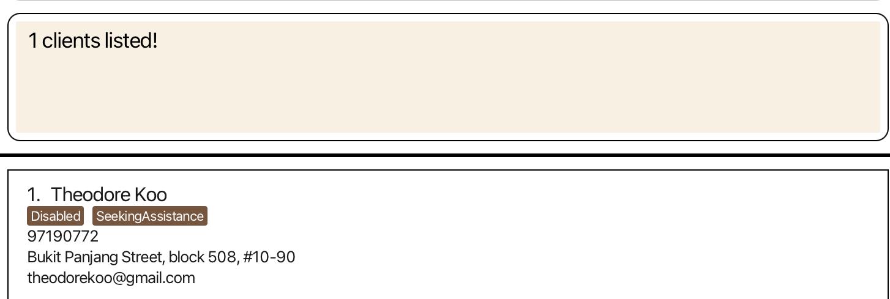

Social Worker's Efficiency Enhancer (**SWEE**) is a **desktop application for managing your contact details, optimized for use via a Command Line Interface** (CLI) while still having the benefits of a Graphical User Interface (GUI).  
If you can type fast, SWEE can get your contact management tasks done faster than traditional GUI apps.  
This is ideal as you do not often bring a mouse out with you on site visits to clients or on the go. 
<br>
## Who is it for and what can it do for me?
This application is intended for people involved with social work, social workers, volunteers, and community partners who 
have a need to manage contacts and their associated information. We offer a quick way for you to store their name, address, 
phone number, email and notes about them. We also support tagging contacts for easier searching. Additionally, we offer a way to 
keep track of upcoming appointments with them. 


<div class="page-break"></div>

--- 

## Table of contents
* Table of Contents
{:toc}

--------------------------------------------------------------------------------------------------------------------

<div class="page-break"></div>

## Quick start

### Glossary of terms

| Terms                | Meaning                                                                                                                                                         |
|----------------------|-----------------------------------------------------------------------------------------------------------------------------------------------------------------|
| Java                 | Java is a platform that SWEE is built in, by installing java you give your computer the ability to understand and carry out instructions that make up this app. |
| Application          | Also known as app or software, in this user guide it mainly refer to the application, SWEE.                                                                     |
| Parameters / Options | User given specifics for an instruction. For example the index of a client to update. Some parameters are optional meaning they can be left out.                | 
| Client               | Used interchangeably with contacts, in a social work setting normally refer to the person a social worker is serving.                                           |
| Keyword              | Refers to a predefined word or series of character used to denote something.                                                                                    |
| Command              | Instructions for SWEE to do something. They can include keywords and parameters.                                                                                | 
| Directory            | Commonly called a folder.                                                                                                                                       |
| Index                | Refer to the index number of something. If something is the second item, its index is 2.                                                                        |
| GUI                  | Graphical User Interface, the desktop application the user sees                                                                                                 |
| CLI / Command line   | An application that presents a text only interface, e.g. PowerShell, cmd, Terminal on Windows, Bash or Shell in Linux, Terminal in MacOS.                       |

💡🚨 Note that some screenshots may be outdated as the application constantly evolves. However, you will still be able to get the full use and understanding from the information displayed in the GUI. 

<div class="page-break"></div>

### Setting up the application

1. Ensure you have Java `11` or above installed in your Computer. You can find a copy [here](https://adoptium.net/temurin/releases/?version=11).  
   Java is needed to run the applications.

1. Download the latest `SWEE.jar` from [here](https://github.com/AY2324S2-CS2103T-T17-1/tp/releases). We will refer to it as the jar file or the application from now on.

1. Copy the jar file to the folder you want to use as the _home folder_ for your AddressBook.

   1. Open the application in a way that suits your operating system. For example, on Windows, you can just double-click the file.<br>
      Shortly after, a graphical interface (GUI) like the one shown below should pop up. Take note that the app already includes some example data for you to see.<br>
      
   2. On first launch, it will present you with some example clients to show you a rough idea of how clients will look like.<br>
      Feel free to delete them and add your own. They are used in the [New User tutorial](#new-user-tutorial).
   3. This _home folder_ will contain files generated and used by SWEE.
   4. 🚨 In case double clicking does not work, open a command line terminal in the home directory and run
      `java -jar SWEE.jar`

1. Type the command in the command box and press Enter to execute it. e.g. typing **`help`** and pressing Enter will open the help window.<br>
   Refer to the [New user tutorial](#new-user-tutorial)

1. Refer to the [Features](#features) below for details of each command.

1. 💡🚨 Note that some screenshots may be outdated as the application constantly evolves. However you will still be able to get the full use and understanding from the information displayed in the GUI.

--------------------------------------------------------------------------------------------------------------------

<div class="page-break"></div>

### New User Tutorial

If you are a new user you can follow this tutorial and get a quick rundown of the application and its core features!  
This assumes a fresh installation of SWEE with the example clients serving as an example.  

#### Introduction to the user interface


The user interface is primarily divided into 4 regions are shown by the different boxes.

1. This is the Command Box. Commands are typed here and carried out by the application. 
2. Messages from the command that was run are displayed here. If the command runs into a problem, it will display here as well.
   For example if the user typed in an invalid command or something unexpected caused the program to not work.
3. This is the client list. Clients are displayed here in cards, see below. It is scrollable meaning you can navigate down and up like a webpage or word document.
4. A Client card holds information relevant to each client. The number beside the names of each user is the index. 
   This index is used in some commands to specify the client being edited. The words in brown boxes are tags a 
   client have. It shows all their details along with the number of appointments and next upcoming appointment if any.

---
<div class="page-break"></div>

<div markdown="block" class="alert alert-info">

**:information_source: Notes about the command format and screenshots:**<br>

* Words in `UPPER_CASE` are the parameters to be supplied by the user.<br>
  e.g. in `add --name=NAME`, `NAME` is a parameter which can be used as `add n/John Doe`.

* Items in square brackets are optional.<br>
  e.g `--name=NAME [--tags=TAG]` can be used as `--name=John Doe --tags=friend` or as `--tags=John Doe`.

* Items with `…`​ after them can be used multiple times including zero times.<br>
  e.g. `[--tags=TAG]…​` can be used as ` ` (i.e. 0 times), `--tags=SECDC`, `--tags=NECDC --tags=FinAid` etc.

* Parameters can be in any order.<br>
  e.g. if the command specifies `--name=NAME --phone=PHONE_NUMBER`, `--phone=PHONE_NUMBER --name=NAME` is also acceptable.

* Extraneous parameters for commands that do not take in parameters (such as `help`, `list`, `exit` and `clear`) will be ignored.<br>
  e.g. if the command specifies `help 123`, it will be interpreted as `help`.

* If you are using a PDF version of this document, be careful when copying and pasting commands that span multiple lines as space characters surrounding line-breaks may be omitted when copied over to the application.
</div>


<div class="page-break"></div>

#### Adding a new client

Lets start by adding a new client. You can copy the command below for an example:

<code>
add --name=Theodore Koo --phone=98001715 --email=theodore@example.com  
--addr=Prince Street, Block 144, #19-14 --tags=Disabled --note=Lactose Intolerant
</code>

1. `add` This is the command for adding new contacts
2. `--name=Theodore Koo` specifies the name parameter as Theodore Koo
3. `--phone=98001715` specifies the phone number.
4. `--email=theodore@example.com` specifies the email parameter as `theodore@example.com`. 
5. `--addr=Prince Street, Block 144, #19-14` indicates the address parameter. You are providing the address as `Prince Street, Block 144, Apartment 19-14`. 
6. `--tags=Disabled` is used to assign a tag or label to the contact. In this case, you're labeling or tagging the contact as 'Disabled'. 
7. `--note=Lactose Intolerant` specifies a note to be attached to this contact's information. The note here is 'Lactose Intolerant'.
   This is useful to attach additional information about an user. 

You should see something similar to below. 



If you scroll to the bottom, you should see the client card of the newly added client.

<div class="page-break"></div>

#### Editing a client

What happens if you made a typo or if information become outdated? `edit` provides a handy way to edit a client.

```
edit 7 --name=Theo --tags=WalkingImpediment
```

1. `edit` This is the command for editing a client.
2. `7` refers to the index of the client we are editing.
3. `--name=Theo` specifies the name parameter as Theo. This sets the client's new name.
4. `--tags=WalkingImpediment` removes all existing tags and Theo now only have this tag.



<div class="page-break"></div>

#### Finding a client by name

Now we find clients by a name.

```
find-name theo
```

1. `find-name` This is the command for finding a client by their name.
2. `Theo` specifies the name parameter as Theo. This sets the keyword for the search.
   1. It is possible to have more than 1 word, see [`find-name`](#locating-clients-by-name-find-name).
3. The client list will now display every client whose name contains at least one word in the keywords given.



<div class="page-break"></div>

#### Viewing a client

Now we view a client at the specified index.

```
view 1
```

1. `view` This is the command for viewing a specific client.
2. The index is based on the current displayed clients.
3. The information is shown in the command result box. 

[//]: # (![]&#40;images/new-user-tutorial/findNameCommand.png&#41;)

<div class="page-break"></div>


#### Deleting a client

Now we delete a client at the specified index.

```
del 1
```

1. `del` This is the command for deleting a specific client.
2. The index is based on the current displayed clients.
   1. 💡 Observe that for commands using client index, it is always the index of the currently displayed clients.
3. The command shows the name of the client being deleted in the command result box.

[//]: # (![]&#40;images/new-user-tutorial/findNameCommand.png&#41;)

<div class="page-break"></div>


#### Listing all clients

Now with an empty list, we run a command to show **all** clients. 

```
list
```

1. `list` This is the command for listing all clients.

[//]: # (![]&#40;images/new-user-tutorial/findNameCommand.png&#41;)

<div class="page-break"></div>


#### Exiting SWEE

Data is stored between usage of the application. We will exit and open the app again.

```
exit
```

1. `exit` This is the command for exiting the application.
2. Open the application again. The clients are still there.

<div class="page-break"></div>


#### Scheduling an appointment for clients

Observe that Natasha (index 5) has no appointments. We will schedule an appointment.  
Make **sure to set the date after today**.

```
sched 5 --title=Lunch Gathering --from=14/05/2024 15:00 --to=14/05/2024 15:20 --addr=Suntec City 
```

1. `sched` This is the command for scheduling an appointment for a client.
2. `5` is the index of Natasha.
3. `--title=` is used to indicate the title of the appointment. 
4. `--from=` and `--to=` specifies the start and ending date and time respectively.
5. The format is `dd/MM/yyyy HH:mm`: days/Months/year Hour:Minutes. The hours are in 24 hours format.
6. If you set the date to be in the future, you will realise the display of next appointment have changed as well.
7. Observe that the total number of appointments increased.
8. To see all of a client's appointment use the `view` command, try `view 2` to see Hu Tao's appointments.


<div class="page-break"></div>


#### Unscheduling an appointment for clients

Observe that Hu Tao (index 2) has 2 appointments. We will unschedule an appointment.

```
unsched 2 --appt=2 
```

1. `unsched` This is the command for unscheduling an appointment for a client.
2. `2` is the index of Natasha.
3. `--appt=` specifies the index of the appointment to unschedule. In this case 2.
4. Notice that Hu Tao's total number of appointments decreased and she no longer has an upcoming appointment.

<div class="page-break"></div>


#### Editing notes of clients

We will add a new note to Serval Landau (index 6).

```
edit 6 --note=Recently had dinner and he told me that he wants to be a doc next time  
```

1. `edit` This is the command for editing a client.
2. `6` is the index of Serval Landau.
3. `--note=` specifies the new note to store.
4. This can be longer than 1 word, making it ideal to store detailed notes. 

<div class="page-break"></div>


## Summary of Commands

Action | Format, Examples
--------|------------------
**Add** a client | `add --name=NAME --phone=PHONE_NUMBER --email=EMAIL --addr=ADDRESS --note=NOTE [--tags=TAG]…​` <br> e.g., `add --name=James Ho --phone=22224444 --email=jamesho@example.com --addr=123, Clementi Rd, 1234665 --tags=friend --tags=colleague --note= Allergic to seafood`
**Clear** delete all clients in the app | `clear`
**Delete** a client | `del INDEX`<br> e.g., `del 3`
**Edit** a client's detail | `edit INDEX [--name=NAME] [--phone=PHONE_NUMBER] [--email=EMAIL] [--addr=ADDRESS] [--note=NOTE] [--tags=TAG]…​`<br> e.g.,`edit 2 --name=James Lee --email=jameslee@example.com`
**Find a client by name** | `find-name KEYWORD [MORE_KEYWORDS]`<br> e.g., `find-name James Jake`
**Find a client by tag** | `find-tag KEYWORD [MORE_KEYWORDS]`<br> e.g., `find-name Disabled Risky`
**List** all clients | `list`
**View** client's details | `view INDEX`<br> e.g., `view 2`
**Schedules** an appointment | `sched INDEX --title=TITLE --from=DATETIME --to=DATETIME --addr=ADDRESS`<br>DATETIME in `dd/MM/yyyy HH:mm` format<br> e.g., `sched 1 --title=Monthly touchbase --from=14/03/2024 15:00 --to=14/03/2024 15:20 --addr=Meeting Room A, 358 Clementi Ave 2 #01-285 Singapore 120358`
**Unschedules** an appointment | `unsched CLIENT_INDEX --appt=APPT_INDEX`<br> e.g., `unsched 1 --appt=2`
**Help** show help with link to this guide | `help`

<div class="page-break"></div>

## Features

### Viewing help : `help`

Shows a message explaning how to access the help page.


Format: `help`


<div class="page-break"></div>

### Adding a client: `add`

Adds a client to the address book.

Format: `add --name=NAME --phone=PHONE_NUMBER --email=EMAIL --addr=ADDRESS [--tags=TAG]…​`

<div markdown="span" class="alert alert-primary">:bulb: **Tip:**
A client can have any number of tags (including 0)
</div>

**Important**: You cannot leave tags empty, i.e. `add --tags=` with nothing for the tags. 

Examples:
* `add --name=John Doe --phone=98765432 --email=johnd@example.com --addr=John street, block 123, #01-01`
  * `add --name=Jane Doe --phone=92933578 --email=janed@example.sg --addr=Amy street, block 123, #11-02 --tags=Disabled --tags=SeekingAssistance`

### Listing all clients : `list`

Shows a list of all clients in the address book.

Format: `list`


<div class="page-break"></div>

### Editing a client : `edit`

Edits an existing client in the address book.

Format: `edit INDEX [--name=NAME] [--phone=PHONE] [--email=EMAIL] [--addr=ADDRESS] [--tags=TAG]…​`

* Edits the client at the specified `INDEX`. The index refers to the index number shown in the displayed client list. The index **must be a positive integer** 1, 2, 3, …​
* At least one of the optional fields must be provided.
* Existing values will be updated to the input values.
* When editing tags for a client, any pre-existing tags will be directly replaced with the new ones provided in the command.<br>
  This means that the tag update is not cumulative; unless a tag is specified in the new command, it will not be retained from the previous set of tags.<br>
  If the tag option is not specified, i.e. `--tags=`, the existing tags will be left as is
* You can remove all the client’s tags by typing `--tags=` without
    specifying any tags after it.

Examples:
*  `edit 1 --phone=91234567 --email=johndoe@example.com` Edits the phone number and email address of the 1st client to be `91234567` and `johndoe@example.com` respectively.
*  `edit 2 --name=Betsy Crower --tags=` Edits the name of the 2nd client to be `Betsy Crower` and clears all existing tags.


<div class="page-break"></div>

### Viewing a client's Information: `view`
Displays the saved information about a client.

Format: `view INDEX`

* Displays client information at the specified `INDEX`.
* The index refers to the index number shown in the displayed client list.
* The index **must be a positive integer** 1, 2, 3, …​

Examples:
* `list` followed by `view 2` displays the information of the 2nd client in the address book.
* `find Betsy` followed by `del 1` displays the information of
   the 1st client in the results of the `find` command.

### Locating clients by name: `find-name`

Finds clients whose names contain any of the given keywords.

Format: `find-name KEYWORD [MORE_KEYWORDS]`

* The search is case-insensitive. e.g `hans` will match `Hans`
* The order of the keywords does not matter. e.g. `Hans Bo` will match `Bo Hans`
* Only the name is searched.
* Only full words will be matched e.g. `Han` will not match `Hans`
* Clients matching at least one keyword will be returned (i.e. `OR` search).
  e.g. `Hans Bo` will return `Hans Gruber`, `Bo Yang`

Examples:
* `find-name John` returns `john` and `John Doe`
* `find-name alex david` returns `Alex Yeoh`, `David Li`<br>
  


<div class="page-break"></div>

### Locating clients by tag: `find-tag`

Finds clients whose tags contain any of the given keywords.

Format: `find-tag KEYWORD [MORE_KEYWORDS]`

* The search is case-insensitive. e.g. `disabled` will match `Disabled`
* The order of the keywords does not matter e.g. `disabled risky` will match `risky disabled`
* Only the Tag is searched.
* Only full words will be matched e.g. `dis` will not match `disabled`
* Clients matching at least one keyword will be returned (i.e. at least one is present)<br>
  e.g. `disabled risky` will return clients that has at least one tag that is `disabled` or `risky`.<br>
  So clients with tags `disabled` and `diabetic`, and a client with `risky` and `diabetic` will be returned

Examples:
* `find-tag disabled` returns all clients who are tagged `disabled`<br>
  
* `find-tag disabled schizophrenic` will return `disabled`, `Schizophrenic`<br>
  


<div class="page-break"></div>

### Deleting a client : `del`

Deletes the specified client from the address book.

Format: `del INDEX`

* Deletes the client at the specified `INDEX`.
* The index refers to the index number shown in the displayed client list.
* The index **must be a positive integer** 1, 2, 3, …​

Examples:
* `list` followed by `del 2` deletes the 2nd client in the address book.
* `find Betsy` followed by `del 1` deletes the 1st client in the results of the `find` command.

### Clearing all entries : `clear`

Clears all entries from the address book.

Format: `clear`

### Exiting the program : `exit`

Exits the program.

Format: `exit`


<div class="page-break"></div>

### Saving the data

SWEE data are saved in the hard disk automatically after any command that changes the data. There is no need to save manually.

### Editing the data file

SWEE data are saved automatically as a JSON file `[JAR file location]/data/addressbook.json`. Advanced users are welcome to update data directly by editing that data file.

<div markdown="span" class="alert alert-warning">:exclamation: **Caution:**
If your changes to the data file makes its format invalid, SWEE will discard all data and start with an empty data file at the next run. Hence, it is recommended to take a backup of the file before editing it.<br>
Furthermore, certain edits can cause the SWEE to behave in unexpected ways (e.g., if a value entered is outside of the acceptable range). Therefore, edit the data file only if you are confident that you can update it correctly.
</div>


--------------------------------------------------------------------------------------------------------------------


<div class="page-break"></div>

## FAQ

**Q**: How do I transfer my data to another Computer?<br>
**A**: Install the app in the other computer and overwrite the empty data file it creates with the file that contains the data of your previous AddressBook home folder.

--------------------------------------------------------------------------------------------------------------------

## Known issues

1. **When using multiple screens**, if you move the application to a secondary screen, and later switch to using only the primary screen, the GUI will open off-screen. The remedy is to delete the `preferences.json` file created by the application before running the application again.

--------------------------------------------------------------------------------------------------------------------

